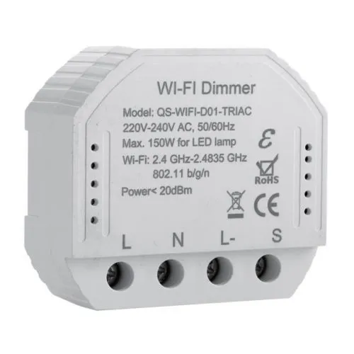
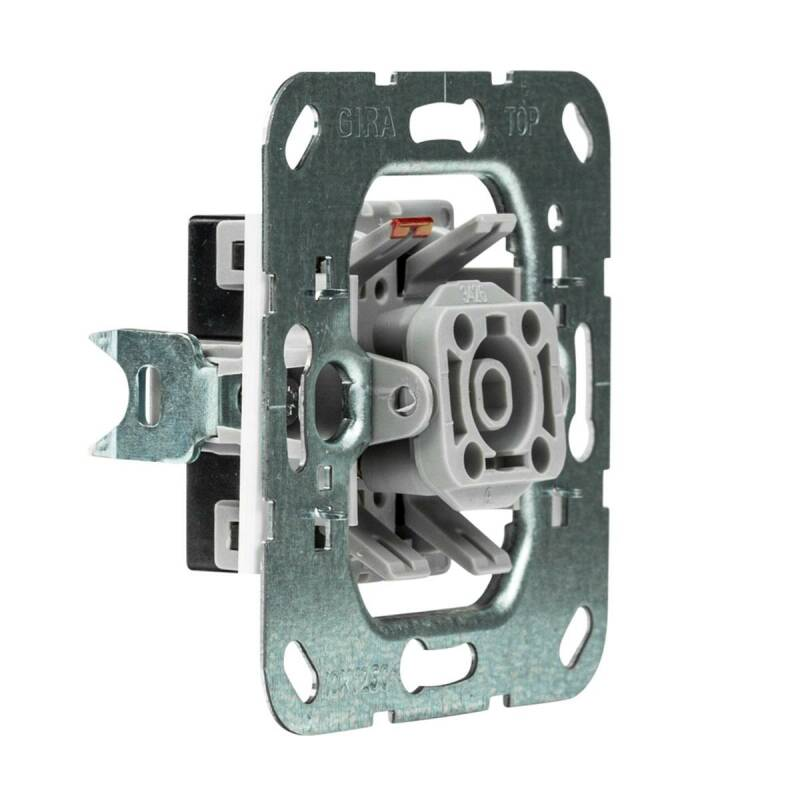

# A wake-up light using a dimmer wall module
Personal project to use a wall module behind a normal switch to turn on the ceiling light in the bedroom.

## Needed hardware

 <b>Wifi Wall Dimmer Module</b>
 In this case i had a "QS-WiFi-D01-TRIAC 150W Dimmer Module" laying around.
  
<div align="center">
  <kbd>
    
  </kbd>
</div>

 - Pulse switch

<div align="center">
  <kbd>
    
  </kbd>
</div>
 
 - normal wall mount
 - normal ceiling light (with a dimmable led)
 
## Needed software

- [Tasmota software](https://tasmota.github.io/docs/)
- [HomeAssistant software](https://www.home-assistant.io/)	


## Step 1: flash Wall dimmer module with Tasmota firmware

The wall module can not use the normal precompiled tasmota software.
At [the templates page of blakadder](https://templates.blakadder.com/qs-wifi_D01_dimmer.html) this is explained.
It needs a 'dimmer' script. To turn on [scripting in tasmota](https://tasmota.github.io/docs/Scripting-Language/) you have to compile this.
There is an easy manual how to compile tasmota software, completely in the cloud at a [Tasmota-github-page](https://tasmota.github.io/docs/Compile-your-build/).
I used [GitPod](https://www.gitpod.io/) to compile tasmota.

In ```user_config_override.h``` i added
```
#ifndef USE_SCRIPT
#define USE_SCRIPT  // adds about 17k flash size, variable ram size
#endif
#ifdef USE_RULES
#undef USE_RULES
#endif 

#ifdef SCRIPT_POWER_SECTION
#undef SCRIPT_POWER_SECTION
#endif 
```

The last section (defining SCRIPT_POWER_SECTION) is not clearly stated in the bladadder-template-page.
It is needed to control the device by WebGUI and HomeAssistant.

With the new .bin-file you can flash the firmware to the wall-module.
How to flash? It is explained in [the templates page of blakadder](https://templates.blakadder.com/qs-wifi_D01_dimmer.html), but i used [OTA and 'TuyaConvert'](https://tasmota.github.io/docs/Tuya-Convert/) and didn't have to open the device to put wires to it.

## Step 2: add template and script
Reading [the templates page of blakadder](https://templates.blakadder.com/qs-wifi_D01_dimmer.html) you have to add the template for the device to tasmota:
```
 {"NAME":"QS-WiFi-D01-TRIAC","GPIO":[0,3200,0,3232,0,0,0,0,0,352,416,0,0,0],"FLAG":0,"BASE":18}
```

And add the script found at a [a github subpage](https://gist.github.com/thxthx0/12074f1f5249e14b2a0aada75f590c9b).

## Step 3: Testing script and availability
I tested the device using a wooden board

<div align="center">
  <kbd>
    
  </kbd>
</div>

----------------------------


## Not covered but links where to find

- how to compile tasmota software
- how to burn tasmota software on wall-module
- HomeAssistant. [Starting point](https://www.home-assistant.io/)
- Building User Interfaces and automations in HomeAssistant. [A lot on YouTube](https://www.youtube.com/results?search_query=home+assistant+beginners+guide)

### License

This project is licensed under the [MIT License](LICENSE.md).

## Acknowledgments

Inspiration, code snippets, etc.
 * [README copied from Michael Stickels README template](https://github.com/MichaelStickels/README_Template)
 * [Adapted from TINY README](https://gist.github.com/noperator/4eba8fae61a23dc6cb1fa8fbb9122d45)


------------------------

# Examples to use in editing

## level 2 header
### level 3 header

- opsomming 1
- opsomming 2
- [ESPHome software](https://esphome.io/)  		(to program the ESP8266)
 
 Plaatje

Code
```
# button functionality
# Button is pushed low for 0,5 sec
button:
  - platform: template
    name: ${devicename} Button-CHANNEL-RX-IO3
    id: wemosd1_rx_button
    icon: "mdi:gesture-tap-button"
    on_press:
      - logger.log: "Knop CHANNEL ingedrukt = output RX even LOW = CHANNEL"
      - switch.turn_off: pin3   # negative: pin=off => output low
      - delay: 500ms 
      - switch.turn_on: pin3    # pin=on => output high
  - platform: template
    name: ${devicename} Button-UP-D5-IO14
    id: wemosd1_d5_button
    icon: "mdi:gesture-tap-button"
    on_press:
      - logger.log: "Knop UP ingedrukt = output D5 even LOW = UP"
      - switch.turn_off: pin14   # negative: pin=off => output low
      - delay: 500ms 
      - switch.turn_on: pin14    # pin=on => output high
  - platform: template
    name: ${devicename} Button-STOP-D6-IO12
    id: wemosd1_d6_button
    icon: "mdi:gesture-tap-button"
    on_press:
      - logger.log: "Knop STOP ingedrukt = output D6 even LOW = STOP"
      - switch.turn_off: pin12   # negative: pin=off => output low
      - delay: 500ms 
      - switch.turn_on: pin12    # pin=on => output high
  - platform: template
    name: ${devicename} Button-DOWN-D7-IO13
    id: wemosd1_d7_button
    icon: "mdi:gesture-tap-button"
    on_press:
      - logger.log: "Knop DOWN ingedrukt = output D7 even LOW = DOWN"
      - switch.turn_off: pin13   # negative: pin=off => output low
      - delay: 500ms 
      - switch.turn_on: pin13    # pin=on => output high
```

Tabel

| RGB LED (PL9823)            | ESP - WemosD1 mini Pro |
|-----------------------------|------------------------|
| (short) pin 1 Data In (DI)  | TGPIO00 = D3           |
| (short) pin 2 V+ (5V)       | 5V                     |
| (long)  pin 3 GND           | GND                    |
| (long)  pin 4 Data Out (DO) | not connected          |

Bullet's

### To-do

- [x] Working with a prototype-board
- [ ] ~~Redesign and use an dedicated pcb~~
- [ ] ~~Temperature & Humidity sensor~~
- [ ] Design and print a nice 3D case


